# FlexControl 14

## What’s this?

`FlexControl 14` is a multi-purpose MIDI controller and decoder. It drives 14 buffered digital outputs, which can be controlled at the same time by its 14 on-board digital inputs, by incoming MIDI messages, or by a second `FlexControl 14` board. Any digital input can also transmit up to three MIDI messages at once.

### Hardware features

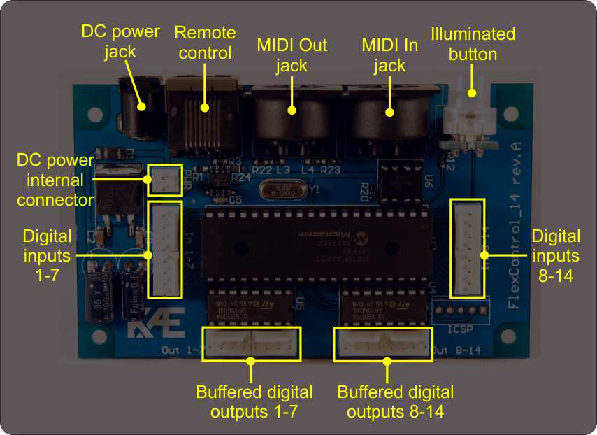

- 14 high-current open-collector digital outputs for relays / LEDs
- 14 digital inputs (pulled up) for buttons or switches
- All digital inputs and outputs are brought out on standard 2.54 mm male headers
- 1 ‘MIDI In’ DIN5 connector
- 1 ‘MIDI Out’ DIN5 connector
- Semi-transparent illuminated button for programming MIDI presets
- RJ-45 jack for connecting a second `FlexControl 14` board as a remote control, over a straight-through Ethernet cable
- Phantom power with selectable polarity on pins 1 and 3 of the ‘MIDI In’ jack
- 2.5 mm DC power jack (center pin negative)
- 2-pin DC power connector
- Reverse polarity protection
- Specially designed for panel mounting
- Non-volatile memory holding the configuration and the presets

## Intended audience

Anyone with a basic knowledge of low-voltage electrical circuits and of the MIDI protocol.

## Wiring diagram

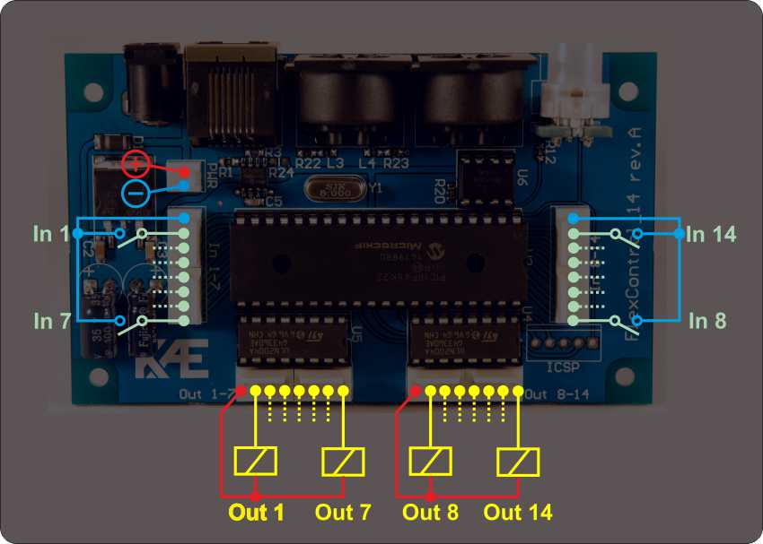

## Digital inputs

All 14 digital input pins are suitable for buttons and footswitches. Momentary (non-retentive) and latching (retentive) types both work. Wire each button between its input pin and GND / 0 V, as shown in the wiring diagram above.

An unwired input pin is pulled up to +5 V.

## Digital outputs

All 14 digital output pins are suitable for resistive or inductive loads — relays, fans, LEDs and the like.

## Operation

- A digital input acts only on the output with the same number (In 1 → Out 1, In 2 → Out 2, and so on).
- All 14 digital outputs latch, unless they are configured otherwise.
- Any output can instead be configured as a pulse output. Pulse outputs fire together whenever another digital output changes state.
- Every output except a pulse output can be switched individually by a MIDI ‘Control Change’ message: a value below 64 turns it off, a value of 64 or above turns it on. An output in a mutex group reacts only to values of 64 or above.
- Some or all outputs can be placed in a mutex group. The board can also memorize the state of the non-mutex outputs and restore it when the same mutex output becomes active again.
- A MIDI ‘Program Change’ message switches every latching output at once. Pulse outputs are not set by it, but they still fire alongside the others.
- A MIDI preset can also be programmed on the board itself, without the configurator.

### What can be configured?

- Function per digital input pin: Digital or MIDI Rx inhibit
- Function per digital output pin: Latch or Pulse
- Reactions to the falling and rising edges of the digital inputs:
  - turn a digital output on or off, or toggle it
  - send up to three MIDI messages at once — every short message type is supported, each on its own channel
- Output polarity (normally off or normally on)
- Mutually exclusive outputs (a “mutex” group). Only one output in the group can be active at a time, and mutex and non-mutex outputs can work side by side.
- Delay at start-up
- MIDI reception channel: all, or one selected
- MIDI Rx controller (CC) number per digital output
- MIDI presets, recalled by incoming ‘Program Change’ messages

## Second board

If you link two boards with a straight-through Ethernet cable, the primary one keeps working as the **Host** and the second becomes the **Remote**. The Remote’s digital inputs work in parallel with the Host’s and its outputs copy the Host’s, so it serves as a second control panel wherever the Host itself is out of reach. 

**Important:** Power the Remote board only from the Host board, through the Ethernet cable. Do not connect a power supply to the Remote board — neither to the DC power jack nor to the internal DC power connector.  
**Important:** Do not connect a MIDI interface to the DIN5 sockets of the Remote board, even if they are fitted.

### Operation

- Input and output pin functions mirror those of the Host.
- Its outputs copy the state of the Host’s outputs.
- It can make the Host transmit its configured MIDI messages.
- It does not react to MIDI Program Change or Control Change messages.
- It does not transmit MIDI messages of its own.

### What can be configured?

- Reactions in the Host to the falling and rising edges of the Remote’s digital inputs: turn a digital output in the Host on or off, or toggle it

## Configuration

The boards are configured with the **FlexControl Web Configurator**, a web application at https://kaladim.github.io/flexcontrol-web-configurator/. Nothing has to be installed — it runs entirely in the browser, on Windows, macOS, Linux, Android and iOS.

On a desktop or laptop computer, use Google Chrome, Microsoft Edge, Opera or Brave. **Firefox does not work**, because it does not support the Web MIDI API.

Safari on an iPhone or iPad does not support Web MIDI either. Use one of these browsers from the App Store instead:

- **MIDIWeb Browser** — https://midiweb.cc/
- **Web MIDI Browser** — https://apps.apple.com/us/app/web-midi-browser/id953846217 — a browser by Takashi Mizuhiki, built for Web MIDI applications; it also enables Bluetooth MIDI on iOS.

### What you need

- A USB-MIDI interface (or a sound card with a MIDI port) connected to your computer.
- Two MIDI leads between the interface and the board, one in each direction:
  - interface **MIDI Out** → board **MIDI In**
  - interface **MIDI In** ← board **MIDI Out**
- The `FlexControl 14` powered on.

Both leads are needed. The application sends a request on one and reads the answer on the other, so with a single lead connected it will never find the board.

### Selecting the MIDI interface

Open the application. The browser asks for permission to use your MIDI devices — grant it, or the application cannot reach the board.

On the first run no interface has been chosen yet:

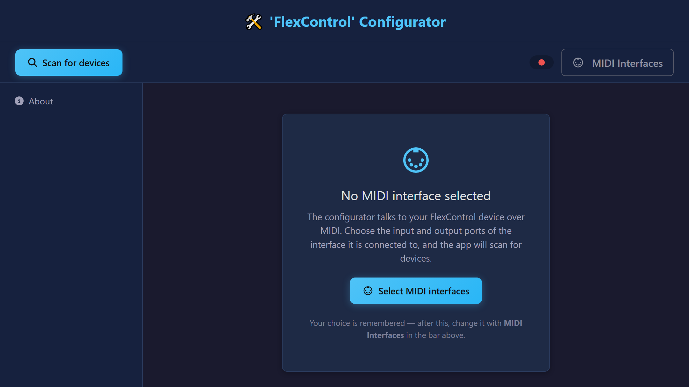

Click **Select MIDI interfaces**, choose the input and the output port of your interface, then click **OK**.

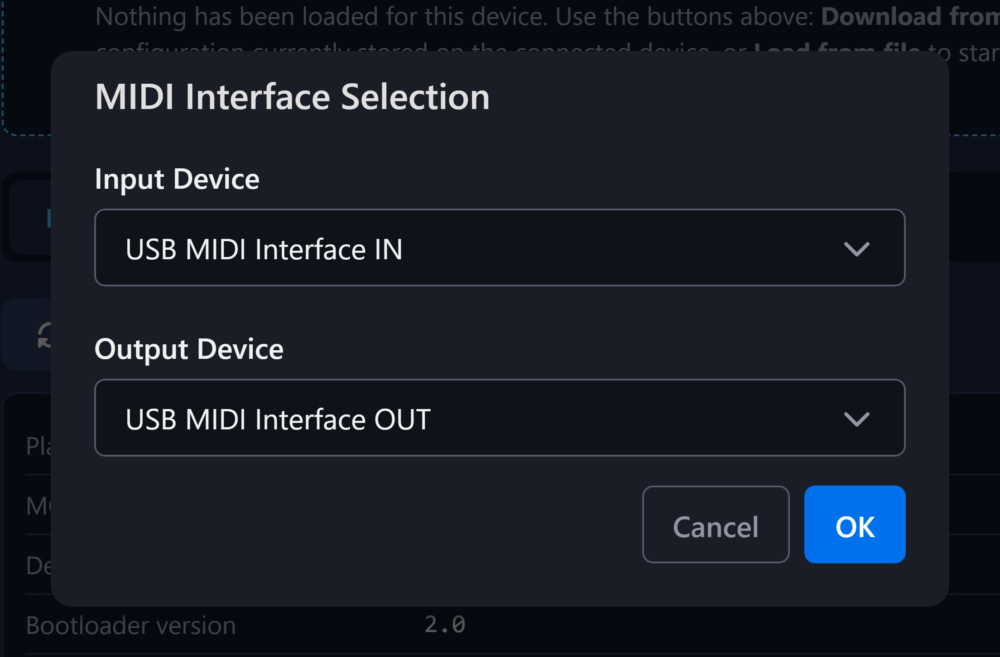

The choice is stored in the browser, so later runs connect on their own. To change it, use the **MIDI Interfaces** button in the top bar.

### Finding the board

As soon as the ports are open, the application scans for devices. Every board that answers appears as a badge next to the **Scan for devices** button — **Host**, **Remote**, or both — and the indicator beside the port names turns green. If nothing is found, check the leads and the power, then click **Scan for devices** again.

The sidebar then offers one page per board, **Host config** and **Remote config**, plus **Firmware**:

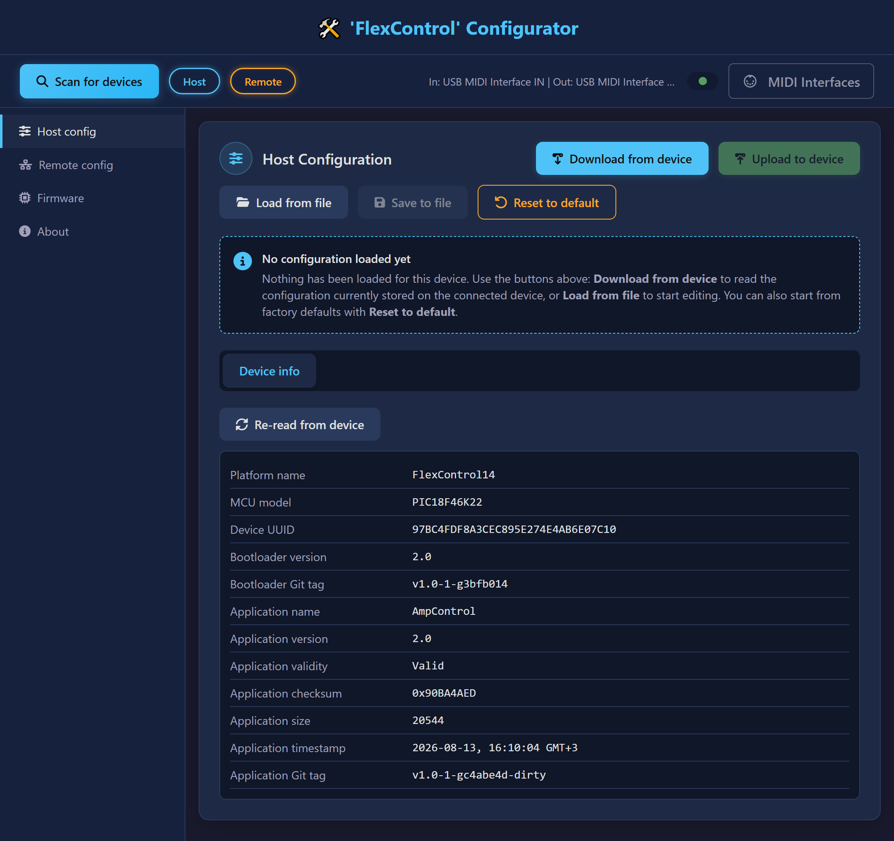

### Loading and saving a configuration

The buttons at the top of a configuration page act on the configuration as a whole:

- **Download from device** — read the configuration currently stored in the board.
- **Upload to device** — write the configuration back to the board.
- **Load from file** — open a configuration saved earlier.
- **Save to file** — store the current configuration on your computer.
- **Reset to default** — replace it with the factory defaults.

The editing tabs stay hidden until a configuration is loaded, so a default is never shown as if it had been read from the board. Normally you start with **Download from device** and edit what the board actually holds.

Some settings are only read by the firmware at start-up. When an upload changes one of them, the application says so; power the board off and on again to apply it.

### Input pins

Click a pin in the numbered strip to edit it. Its parameters appear underneath, and a pin with the **Digital** function also gets a table of up to three MIDI messages to transmit.

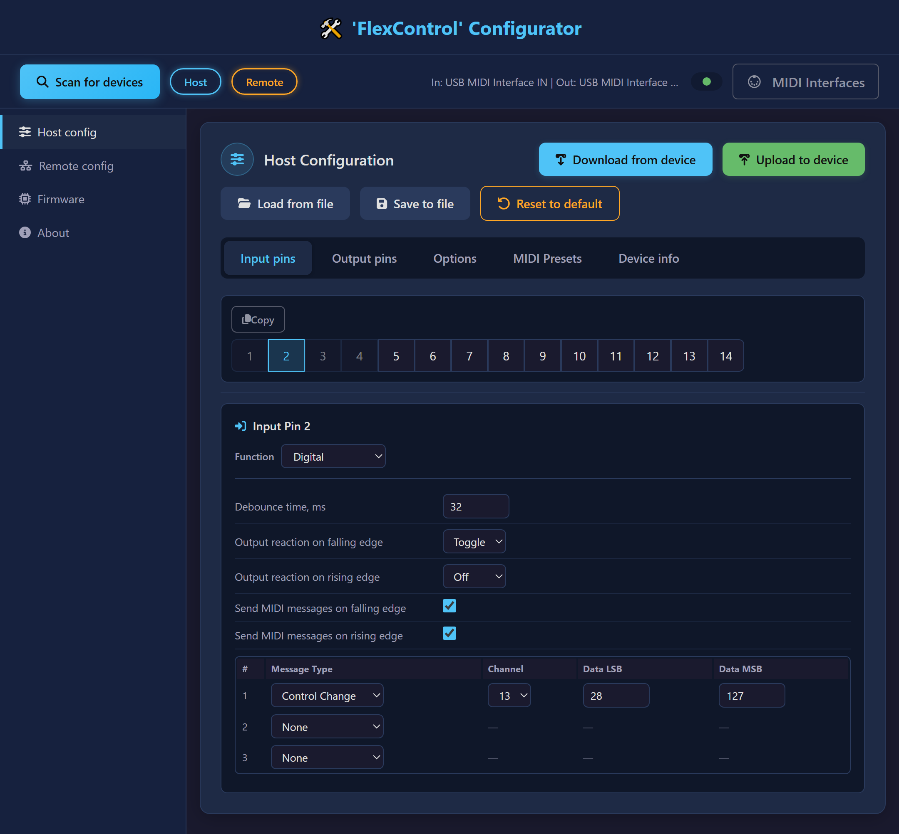

An input pin acts only on the output pin with the same number (In 1 → Out 1, In 2 → Out 2, and so on). If that output is set to **Pulse**, the input pin has no effect at all, and the application says so instead of offering settings that would do nothing.

**Copy** stores the parameters of the selected pin. Selecting another pin then offers **Paste**, which applies them — the quickest way to give several pins the same behavior.

### Output pins

Output pins work the same way: click a pin, then edit it. The **Function** setting decides which parameters exist — **Mutex** belongs to a latching output, the pulse duration to a pulse output.

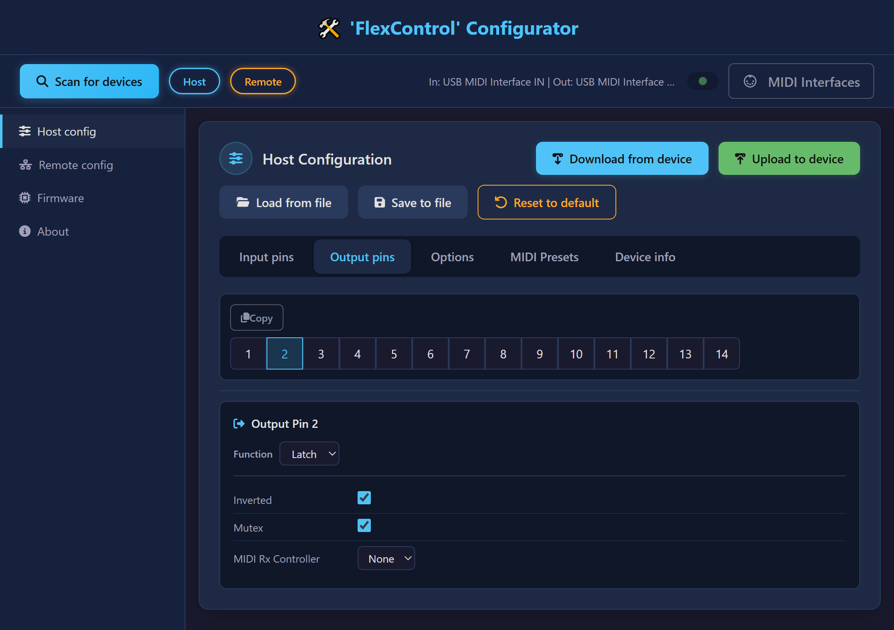

### Options

The **Options** tab holds the settings that apply to the whole board rather than to a single pin:

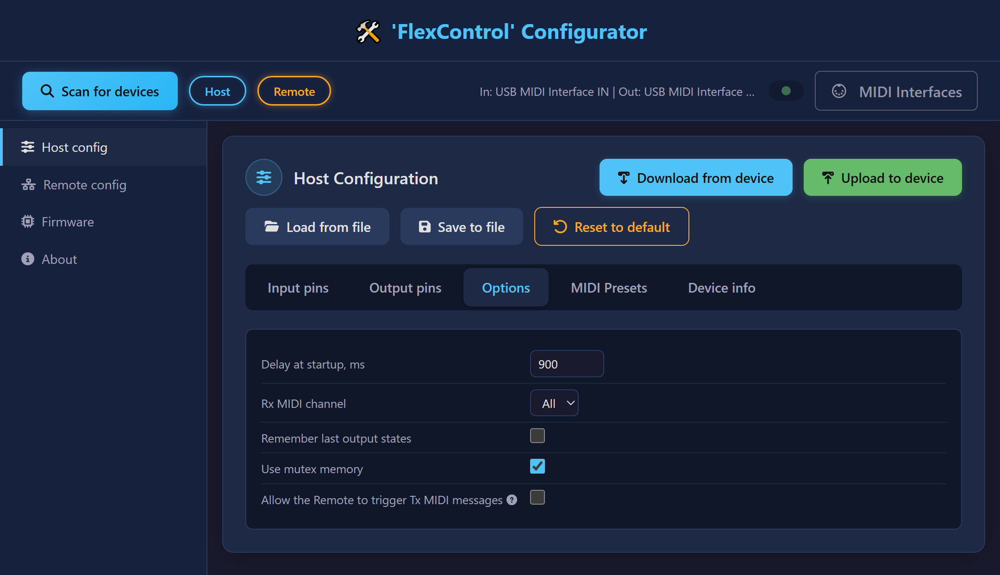

- **Delay at startup, ms** — the board does not switch its outputs for this long after power-up. Useful when a tube amplifier has to warm up first.
- **Rx MIDI channel** — the MIDI channel the board listens on, or **All**.
- **Remember last output states** — start with the output states the board had when it was last powered off.
- **Use mutex memory** — memorize the state of the non-mutex outputs against the active mutex output, and restore it when that mutex output becomes active again.
- **Allow the Remote to trigger Tx MIDI messages** — let an edge on a Remote input pin make the Host transmit the messages configured for the Host input pin with the same number. The Host’s own input pins take precedence.

### MIDI Presets

A MIDI preset is a set of output states recalled by an incoming ‘Program Change’ message. Each of the 128 rows is one preset; tick the outputs that should be active when it is recalled.

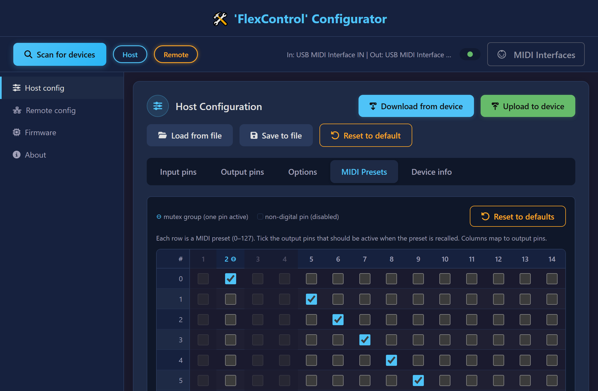

Columns for pins in the mutex group are marked, and only one of them can be ticked per row. Columns for pins that are not latching outputs are disabled.

### Device info

The **Device info** tab identifies the board: its platform and microcontroller, its unique ID, and the versions of the bootloader and of the application it runs. Quote these values when asking for support.

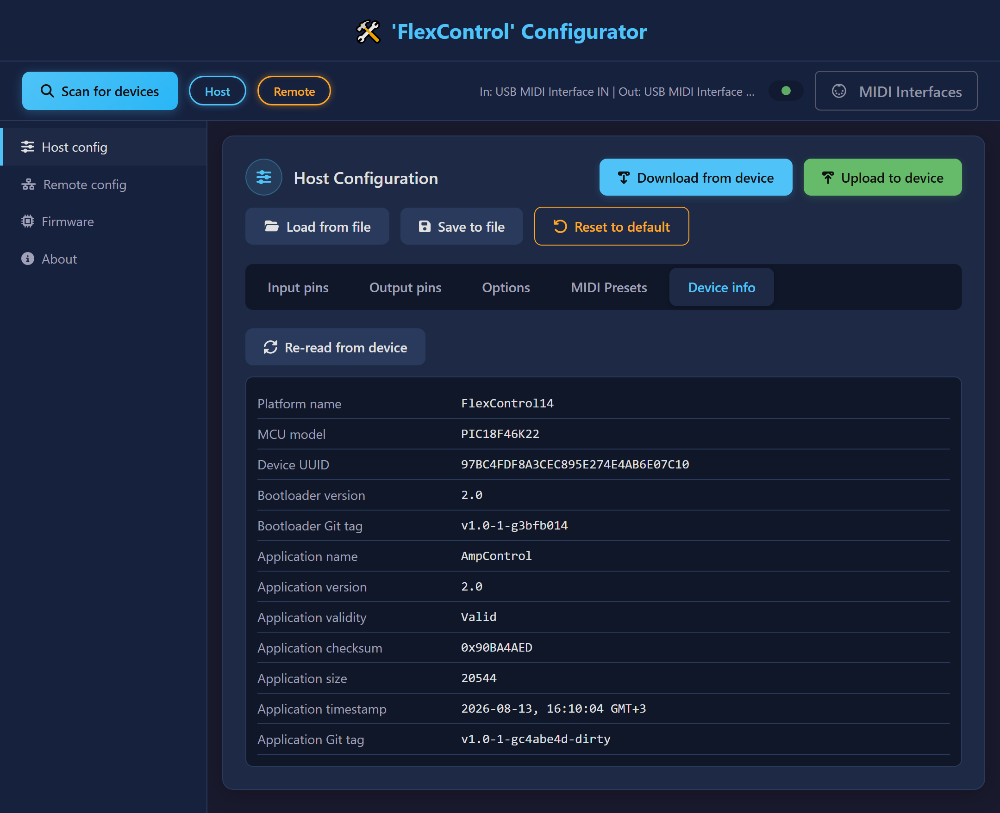

### Configuring the Remote

A Remote board has its own page, with fewer settings. The Remote reports raw pin edges to the Host and the Host decides what they mean, so the pin function and the MIDI messages are shown read-only here and are edited on the Host page. What you set on the Remote page is the reaction each of its pins triggers in the Host.

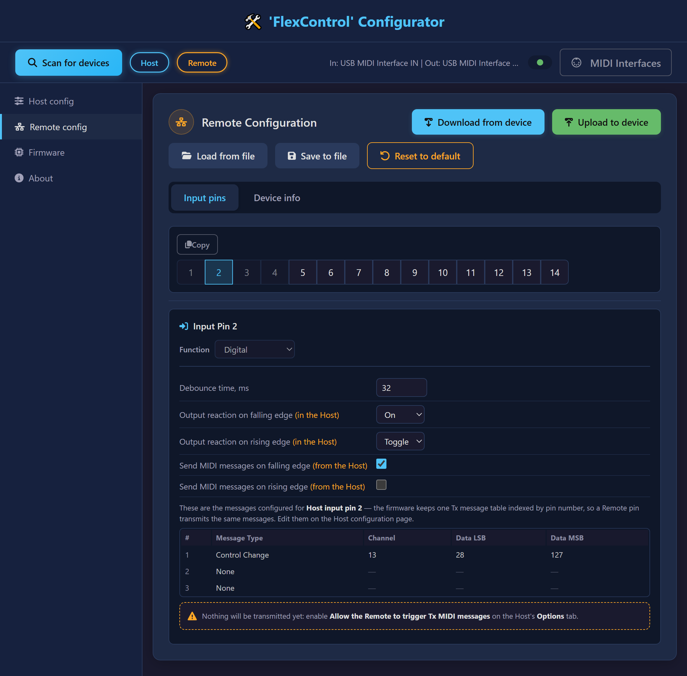

For a Remote pin to transmit MIDI, **Allow the Remote to trigger Tx MIDI messages** must also be enabled on the Host’s **Options** tab.

### Complete parameter list

#### Input pins

| Function | Available parameters | Description |
| --- | --- | --- |
| **Digital** | Debounce time, ms | Time the pin level must stay stable before a change is accepted. It filters out the contact bounce of most switches and buttons. The value is shared by all digital inputs. Values above 100 ms add a noticeable delay to the reaction. |
| **Digital** | Output reaction on falling edge | What the output pin with the same number does when the voltage on this pin goes from 5 V to 0 V: None, Off, On or Toggle. |
| **Digital** | Output reaction on rising edge | The same, for a transition from 0 V to 5 V. |
| **Digital** | Send MIDI messages on falling edge | Transmit this pin’s MIDI messages when the voltage goes from 5 V to 0 V. |
| **Digital** | Send MIDI messages on rising edge | Transmit this pin’s MIDI messages when the voltage goes from 0 V to 5 V. |
| **Digital** | MIDI message table | Up to three short MIDI messages to transmit, each with its own type, channel and data bytes. Only the data bytes that the chosen message type actually uses can be edited. |
| **MIDI Rx inhibit** | Inhibit level | The level at which the pin blocks MIDI reception, Low or High. While the pin sits at that level, incoming MIDI messages are ignored. The value is shared by all pins with this function. |
| **MIDI Rx inhibit** | Debounce time, ms | As above — one value for all digital inputs. |

#### Output pins

| Function | Available parameters | Description |
| --- | --- | --- |
| **Latch** | Inverted | Inverts the active level of the output pin. |
| **Latch** | Mutex | Puts the pin in the mutually exclusive group: when it turns on, every other pin in the group turns off. A group needs at least two pins. |
| **Latch** | MIDI Rx Controller | The Control Change number this output reacts to, or None. |
| **Pulse** | Inverted | Inverts the active level of the output pin. |
| **Pulse** | Pulse duration, ms | How long the pulse lasts. The value is shared by all pulse outputs. |

#### Suggested input pin configuration, by type of connected switch

| Class | Type | Desired output interdependence | Output reactions |   |
| --- | --- | --- | --- | --- |
| Non-retentive/momentary | Pushbutton | Mutex | ↓ | Set |
| Non-retentive/momentary | Pushbutton | Mutex | ↑ | None |
| Non-retentive/momentary | Pushbutton | No | ↓ | Toggle |
| Non-retentive/momentary | Pushbutton | No | ↑ | None |
| Retentive | Switch (visible state) | No | ↓ | Set |
| Retentive | Switch (visible state) | No | ↑ | Clear |
| Retentive | Switch (invisible state) | No | ↓ | Toggle |
| Retentive | Switch (invisible state) | No | ↑ | Toggle |
| Retentive | Switch (invisible state) | Mutex | ↓ | Set |
| Retentive | Switch (invisible state) | Mutex | ↑ | Set |
| Retentive | Rotary switch | Mutex | ↓ | Set |
| Retentive | Rotary switch | Mutex | ↑ | None |

↓ = on falling edge

↑ = on rising edge

## Updating the firmware

1. Go to https://github.com/kaladim/flexcontrol-web-configurator/tree/main/firmware
2. Download the firmware file for your board. It is a **.bin** file whose name carries the board and the application version, for example FlexControl14-AmpControl-v2.0.bin.
3. Open the web configurator, connect to the board as described above, then click **Firmware** in the sidebar.
4. Click the file box and select the file you downloaded. The application checks its signature and shows which board it will be written to.
5. Click **Go!** and wait for the update to finish.

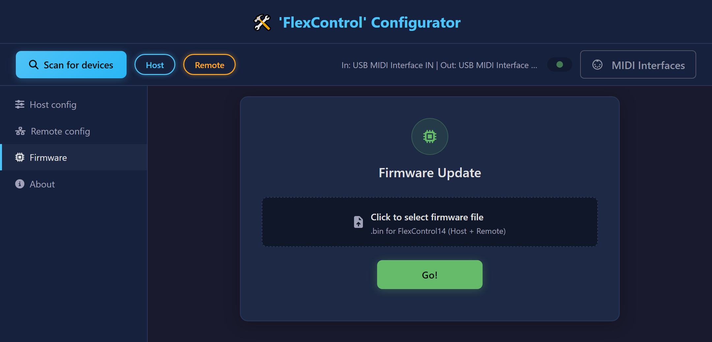

A Host and a Remote need not be the same board type, and each board type has its own firmware file. When two different boards are connected, select one file per board: the application pairs each file with the board it was built for, and refuses one that fits neither.

A board that already runs the version you selected is left untouched.

## MIDI preset programming without the web configurator

Applies to the Host board only, and assumes it has already been configured.

1. Power the *`FlexControl 14`* board on.
2. Connect the MIDI Out socket of your MIDI controller to the MIDI In socket of the `FlexControl 14` board.
3. Press and hold the illuminated button until it starts blinking with a short pulse.
4. Set the outputs to the states you want to store, using the on-board inputs, the Remote, or MIDI Control Change messages.
5. Send a MIDI Program Change message from your controller. The button starts blinking rapidly.
6. Press the button briefly to store the preset. It lights up for a moment, then returns to the short-pulse blink.
7. Repeat steps 4 to 6 for any further presets.
8. To leave the programming sequence, press and hold the button until it goes out, or leave the board idle for about two minutes.

## Supplying phantom power to the MIDI In jack

Some MIDI devices draw their power from the spare pins **1** and **3** of the MIDI Out socket that feeds them. `FlexControl 14` supports this: its power inputs — the DC jack and the internal DC connector — are brought to four jumper pads on the underside of the board. Depending on the device you want to power, bridge either **J1+** and **J1-**, or **J2+** and **J2-**, as shown below:

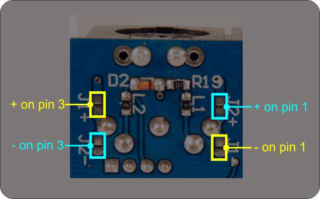

**Please note:** never bridge a J1 and a J2 jumper at the same time. That short-circuits the power supply and will almost certainly destroy it — and the `FlexControl 14` with it.

## Electrical specifications

- Supply voltage: 7.5 – 25 V, 9 – 15 V recommended
- Maximum total current through all outputs: 3 A
- Maximum current per output: 500 mA
- Own consumption: 26 mA at 9 V (no load, all outputs off, LED off)

## MIDI implementation chart

| Message type |   | Can receive | Can send |
| --- | --- | --- | --- |
| Note Off | 8x | - | Yes |
| Note On | 9x | - | Yes |
| Poly Aftertouch | Ax | - | Yes |
| Control Change | Bx | Yes | Yes |
| Program Change | Cx | Yes | Yes |
| Channel Pressure | Dx | - | Yes |
| Pitch Bend | Ex | - | Yes |
| Quarter Frame (MTC) | F1 | - | Yes |
| Song Pointer | F2 | - | Yes |
| Song Select | F3 | - | Yes |
| Tune Request | F6 | - | Yes |
| Timing Clock | F8 | - | Yes |
| Start | FA | - | Yes |
| Continue | FB | - | Yes |
| Stop | FC | - | Yes |
| Active Sensing | FE | - | Yes |
| Reset | FF | - | Yes |

*\*x in the message code = the MIDI channel*

## Straight-through Ethernet cable pinout

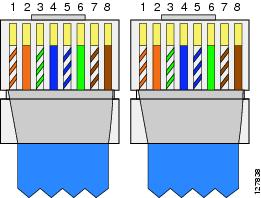

## Mechanical parameters

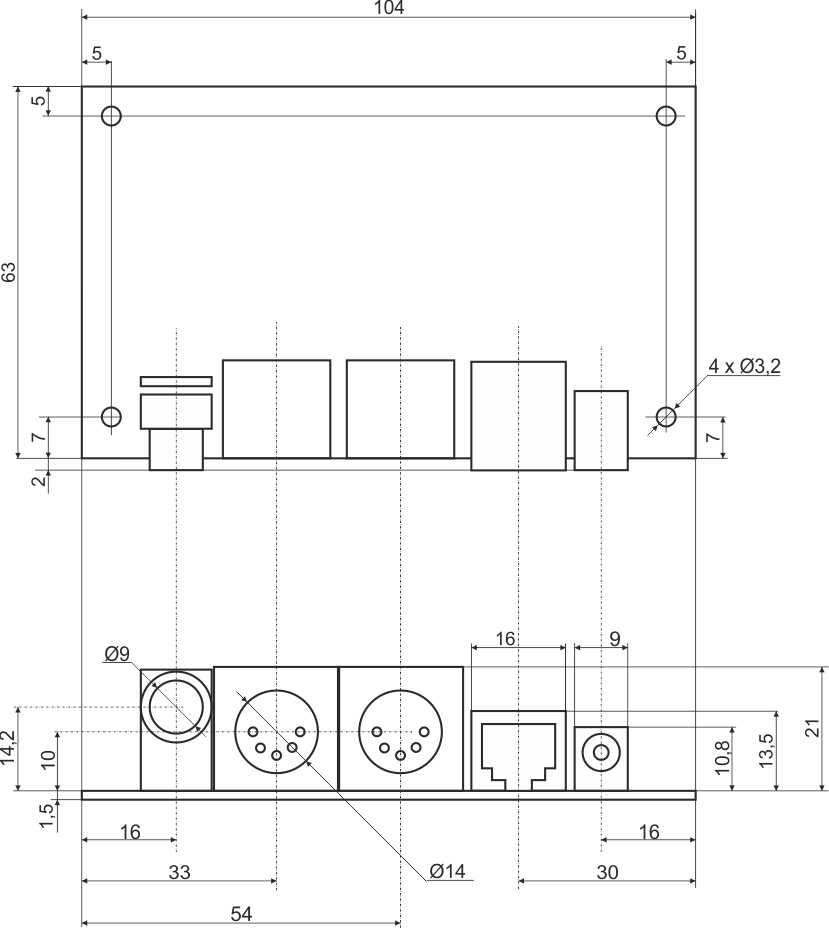

All dimensions in millimeters.
